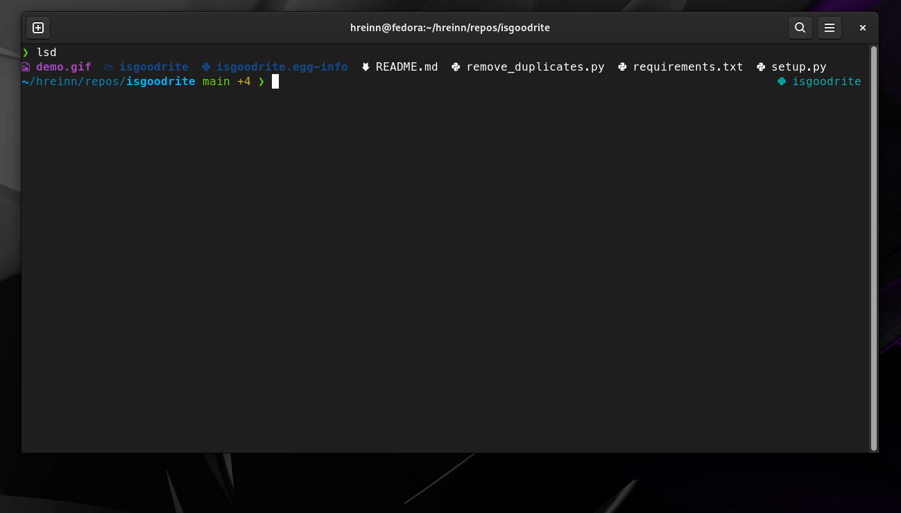
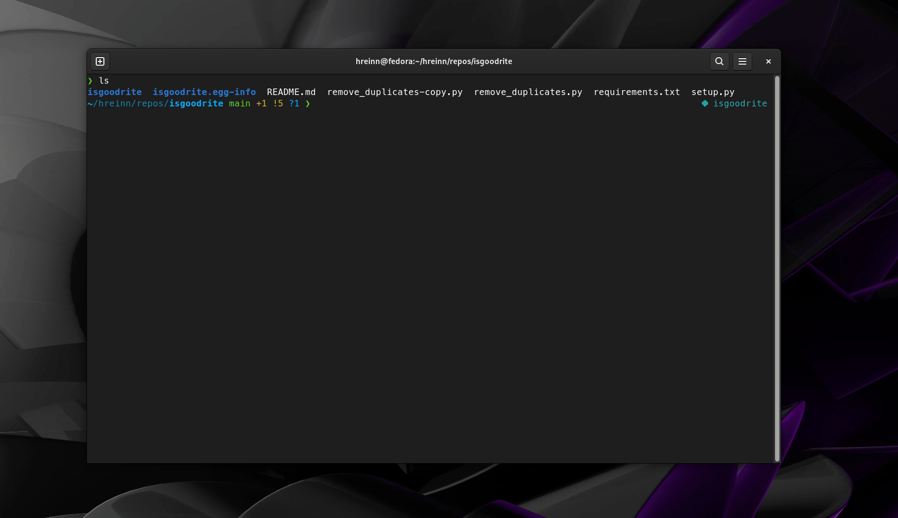

# IS GOOD RITE?!!

`isgoodrite` is a simple command line tool which integrates with a local running ollama.
Use your local ollama to validate your scripts and code using `isgoodrite`.

**Generate New Scripts:**

**Validate your existing scripts:**

...

## SETUP

Setup this tool by installing it with:

    ollama pull qwen2.5-coder:3b
    pip install -r requirements.txt
    pip install -e .

### Defaults

Defaults can be changed in the `isgoodrite/config.py` file. 

* Make sure to check the `OLLAMA_BASE_URL` is set correctly. 
For most the local OLLAMA will be running on "http://localhost:11434" which is the current default.

* `DEFAULT_MODEL` option controls which llm model which will be used by default. 

Note that you will need to reinstall the package with pip after updating the config. `pip install -e .`

## HOW IT WORKS

`isgoodrite` takes a scripts as an input and writes an improved script as a copy of the input file.

## Example

**Create a new script**

    isgoodrite fibonacci_sequence.py --description "Please write a python script with a function that generates a fiboncacci sequence."
or

    python -m isgoodrite fibonacci_sequence.py --description "Please write a python script with a function that generates a fiboncacci sequence."

**Validate your existing Scripts**

    isgoodrite remove_duplicates.py -f --description "Please add a unit test"

or

    python -m isgoodrite remove_duplicates.py --description "Check for any syntax errors please"

### INTEGRATE WITH DIFF-SO-FANCY

https://github.com/so-fancy/diff-so-fancy

`diff-so-fancy`is a great tool for making diffs human-readable. 

Integrate `isgoodrite` with diff-so-fancy, all you need is the `diff-so-fancy` binary in your env and the good old `diff`.  

### INTEGRATE WITH BAT

https://github.com/sharkdp/bat

`bat` A cat(1) clone with syntax highlighting. 

Integrate `isgoodrite` with BAT, all you need is the `bat` binary in your env.  

